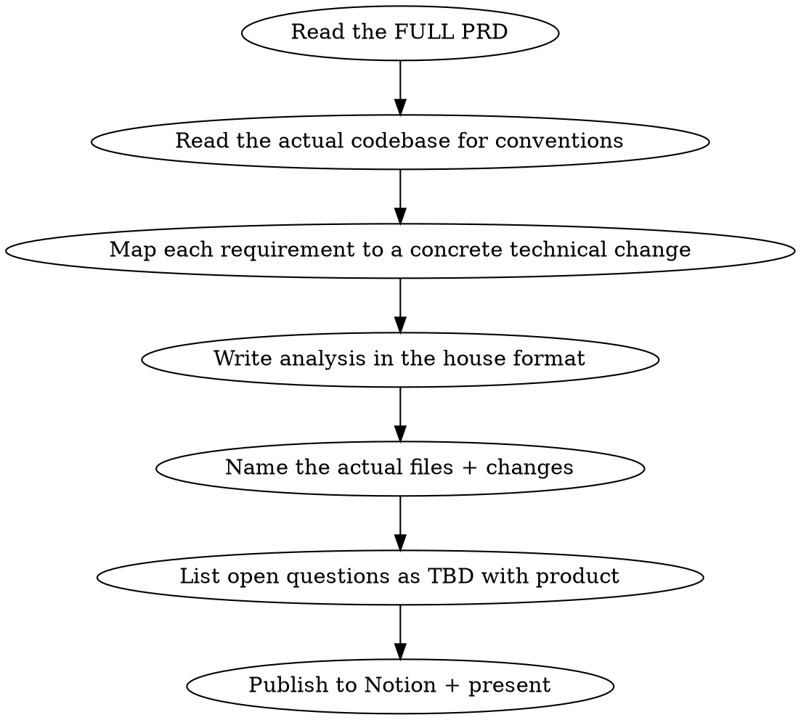

# PRD Tech Analysis

## Overview

Turn a product PRD into a concrete technical analysis. **This skill produces the analysis doc only — it never writes implementation code.** The analysis is **grounded in the actual codebase** — it reuses existing endpoints, table conventions, queue/lambda naming, and event-payload shapes rather than inventing new ones, and it names the actual files that must change. Grounding in what already exists IS the discipline that keeps the design from being over-engineered.

## Process



This skill stops at the analysis. It does **not** write implementation code — even if the PRD is small or the change looks obvious.

**Where to deliver:** default is a **private Notion doc** created via the Notion MCP (`notion-create-pages`), matching the house format below. Drafting locally first as `.md` is fine, but the deliverable lives in Notion. Confirm the parent/workspace if it's not obvious.

### Step 1: Read the full PRD

Notion PRDs are large and structured as: Overview → Problem Definition → Scope Summary (Must Have / Future Ideas) → numbered functional Sections → data-contract tables → callouts → Decision Items.

- Fetch with the Notion MCP. If the result exceeds the token limit, it's saved to a file — slice it in ~80k-char spans via python, or dispatch a subagent to extract it so it stays out of main context.
- The atomic requirement unit is **screen → UI element → {Text/Label, Location, Action, Behaviour}** nested bullets inside `<details>` blocks. Treat `Behaviour:`/`Behavior:` bullets as the implicit acceptance criteria — there are usually no `As a user...` stories or explicit acceptance-criteria headings.
- **Tables** carry the data contracts (events, properties, permission matrices). Parse them separately from prose.
- **Red callouts** = "not ready, don't build yet" / scope caveats. **Yellow callouts** = engineering notes (URL routes for Pendo, strings needing translation). Surface both.
- Anything marked **Future Ideas and Scope** is out of scope — do not design for it.

### Step 2: Read the actual codebase (MANDATORY)

First decide what kind of PRD this is:
- **Existing-feature update** — find the current implementation and frame the analysis as deltas to it (which files/endpoints/tables change, what's added/removed). Read the existing code before proposing changes.
- **New feature** — find the closest existing feature and follow its conventions.

Then find how the codebase already does each thing the PRD needs:

- **Endpoints** — does one already exist you can extend? (e.g. add fields to `PUT /workspace/settings` instead of a new endpoint; add a `?type=all` param to `GET /workspace/users` instead of a parallel route.)
- **Tables** — match existing column conventions, FK targets (e.g. `spaceId` → `bot(id)`), soft-delete via `deletedAt`, `createdAt`/`updatedAt` defaults.
- **Queues / Lambdas** — match the existing naming pattern (`<environment>--ms-...-queue`, `<environment>--ms-...`).
- **Events / payloads** — match the shape of existing chat-activity events (`contactId`, `conversationId`, `eventType`, `payload`, `source`).
- **Internal packages** — `@respond-io/*` packages live on the **respond-io GitHub org**, not just `node_modules`. Fetch the source from there (`gh`) when the analysis depends on a package's real types/shape.
- **End-to-end flow** — a feature usually spans service → lambda → consumer. Trace the whole path, not just the entry point.

If you skip this step the analysis will invent new infrastructure the codebase doesn't need.

### Step 3: Write the analysis in the house format

Mirror the structure below. Mark items already done with ✅. Use `{toggle="true"}` headings and `<details>` for samples (Notion-friendly). Strike through (`~~Name~~`) any existing table/endpoint the new design supersedes.

```markdown
<table_of_contents />

# API
## <Verb-phrase describing the endpoint> {toggle="true"}
	**POST** `/path`
	<details><summary>Sample request</summary> ```json ... ``` </details>
	<details><summary>Sample response</summary> ```json ... ``` </details>
	(Note when reusing an existing endpoint, e.g. "Existing space settings endpoint with new properties.")

# Payload
## Sender                  -- how this actor is identified on messages/events
## <Event> events          -- one <details> per event the feature emits, with sample JSON
## Prompt / Actions        -- LLM prompt template + each action's shape, if relevant

# Architecture
## SQS    -- queue name(s)
## Lambda -- lambda name(s) + <details> Payload
## Tables -- per table: <details> Schema (CREATE TABLE ...) + <details> Sample (JSON row)

# Files & Changes    -- the actual code touchpoints
## <service / package>
	- `path/to/file.js` — what changes and why (new endpoint handler, new column, event emit, etc.)
	- new file `path/to/new.js` — what it does

# TBD with product   -- numbered open questions that block or need a product decision

# Changes and Q&A    -- cross-service ripple: what OTHER services/teams must change
## <Service / owner>
	- <what must change there and why>

# Testing scope
```

Not every section applies to every PRD — drop the ones with nothing in them. Keep samples realistic (real field names from the codebase), not placeholder lorem.

**`# Files & Changes` is required.** Name the actual files (paths) that must change and what each change is — this is the bridge from design to a buildable task. For an existing-feature update, frame these as deltas to the current code you read in Step 2.

**`# Changes and Q&A` is the cross-service hunt — derived fresh per PRD.** A new actor, field, or capability often ripples into services the PRD never mentions. Don't reuse a fixed checklist; reason from THIS feature: what other services read/write this data, list it in dropdowns or reports, count it for billing/limits, export it, or gate it by permission? List each impacted service and what must change there.

### Step 4: TBD with product

Every ambiguity, contested wording (Notion discussion threads), or behaviour the PRD leaves open goes here as a numbered question. Don't guess and bury the assumption — surface it.

### Step 5: Publish and present

Publish the analysis to the private Notion doc and present it. **The skill ends here — do not write implementation code.** If the user wants it built afterward, that's a separate request.

## Keep the design small (not over-engineered)

The changes you recommend in the analysis should be the **smallest reasonable change**:

- Extend existing endpoints/tables/queues before proposing new ones.
- **No premature abstraction** — don't propose interfaces, factories, base classes, or generics unless two concrete callers need them now.
- **No speculative config, feature flags, or extensibility hooks** for Future-Scope items.
- Recommend changes that match the conventions already in the target file/package.

## Common Mistakes

| Mistake | Fix |
|---------|-----|
| Designing API/tables from the PRD alone | Read the codebase first — reuse what exists |
| Inventing a new endpoint for a small addition | Add fields/params to the existing one |
| Designing for "Future Ideas and Scope" items | Those are explicitly out of scope — ignore them |
| Treating only headings as requirements | The `Behaviour:` bullets are the real acceptance criteria |
| Skipping `# TBD with product` | Open questions buried as silent assumptions cause rework |
| Writing implementation code | This skill is analysis only — stop at the doc |
| Vague "update the X service" | Name the actual file paths in `# Files & Changes` |
| Reusing a fixed cross-service checklist | Derive the ripple fresh from THIS feature |
| Proposing layers/abstractions "for later" | Smallest design now; abstract only with 2+ real callers |
